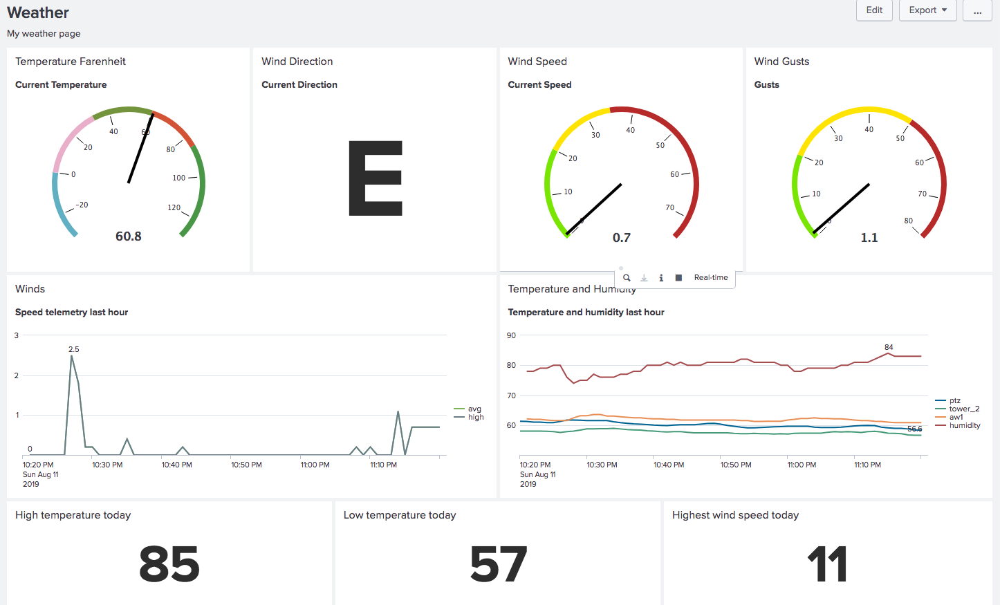

# AmbientWeather WS-1550-IP (version 4.5.8 firmware) HTML Scraping of Live Data HowTo Documentation

This repository holds code I've written to scrape the "Live Data" page data, put them in variables and allow you to uses these variables in your own code without using the API and ambientweater.net. The idea is that it's nice to use IoT but I do not like to be held to these systems for a number of reasons. JSON is a very standard data format. Parsing JSON is easy, especially in Python.

The program gets the HTML data via a standard network call, puts this data in a format that can be parsed using Python tools. The interesting fields data are plucked and put into a JSON sentence. That sentence is pushed to Splunk in my case where I can build my own panels and parse the data using any criteria I choose.

The output to this program looks like this:

{ "ambient1.ham.co" :  {"outHumi": "52", "RelPress": "30.09", "uvi": "6", "avgwind": "0.4", "rainofyearly": "0.04", "windir": "37", "eventrain": "0.02", "solarrad": "711.38", "inTemp": "75.7", "inHumi": "57", "rainofmonthly": "0.04", "rainofdaily": "0.00", "dailygust": "2.2", "rainofweekly": "0.00", "AbsPress": "29.59", "rainofhourly": "0.00", "uv": "2694", "outTemp": "75.2", "outBattSta1": "Normal", "CurrTime": "10:11 8/11/2019", "inBattSta": "Normal", "gustspeed": "1.1"} }

When you pretty up the JSON it'll look like this:

```text
{
	"ambient1.ham.co": {
		"outHumi": "52",
		"RelPress": "30.09",
		"uvi": "6",
		"avgwind": "0.4",
		"rainofyearly": "0.04",
		"windir": "37",
		"eventrain": "0.02",
		"solarrad": "711.38",
		"inTemp": "75.7",
		"inHumi": "57",
		"rainofmonthly": "0.04",
		"rainofdaily": "0.00",
		"dailygust": "2.2",
		"rainofweekly": "0.00",
		"AbsPress": "29.59",
		"rainofhourly": "0.00",
		"uv": "2694",
		"outTemp": "75.2",
		"outBattSta1": "Normal",
		"CurrTime": "10:11 8/11/2019",
		"inBattSta": "Normal",
		"gustspeed": "1.1"
	}
}
```

You can then use JSON to parse out the various fields you may want to interpret. I'm not interested in all the available fields so I parse out what I want with the Python code. Once in Splunk these data fields can be easily used to create all kinds of reports. Another use of this data is to trigger other things. Like when the wind goes above a threshold send out an alert.

I do all of this because one of my weather apps does not use the Internet so going to ambientweater.net is not an option for that application. This tool allows me to get updated weather data as often as I need without restriction. I like to be in total control of all my data.

Splunk is not required for this data to be effective. If you want to push to MySQL and render with your own tools you can. The key is the JSON data in a format that can be manipulated easily.

I currently do not have any internet facing data to demo this. This is the kind of thing I do with Splunk once I've collected the data:


This is a look at how I use Splunk to display the data. Keep in mind that my Ambient Weather station is just one input into this. Splunk will keep the data for as long as I have storage to store the JSON data (years) and I can pivot the data any way I want. None of this depends on access to the Internet.



For the AmbientWeather API documentation go here:

https://github.com/ambient-weather/api-docs